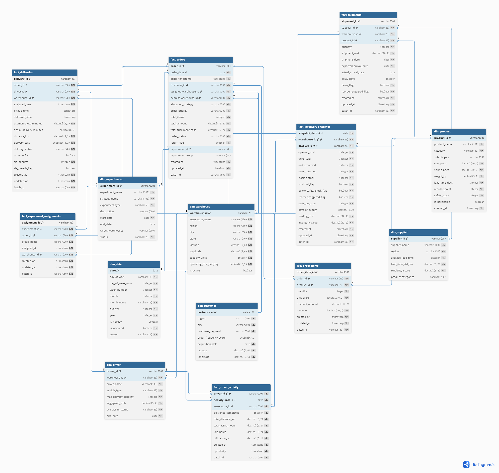

# 📦🚚 Distributed Last-Mile Fulfillment & Inventory Optimization Platform 📈
An End-to-End Supply Chain, Logistics &amp; Operations Intelligence System

> An end-to-end operational intelligence system integrating demand forecasting, inventory optimization, last-mile routing, and A/B experimentation across a distributed warehouse network.

---

## 🏁 Project Status

🚧 In Development — Phase 1: Architecture & Data Modeling

## Data Model

### Entity Relationship Diagram

> Click the diagram to view the interactive version on dbdiagram.io
`https://dbdiagram.io/d/Last-Mile-Fulfilment-Platform-699e4d03bd82f5fce2b9a33c`

**20 Tables:** 7 Dimensions + 7 Facts + 6 Marts (dbt)

| Layer | Tables | Volume |
|-------|--------|--------|
| Dimensions | dim_product, dim_warehouse, dim_supplier, dim_driver, dim_customer, dim_date, dim_experiments | ~11,800 rows (static) |
| Facts | fact_orders, fact_order_items, fact_inventory_snapshot, fact_shipments, fact_deliveries, fact_driver_activity, fact_experiment_assignments | ~26,800 rows/day |
| Marts (dbt) | mart_daily_warehouse_kpis, mart_daily_product_kpis, mart_delivery_performance, mart_allocation_efficiency, mart_cost_optimization, mart_experiment_results | ~534 rows/day |

## backfill
- Get-Content requirements.txt | ForEach-Object { poetry add $_ }
- python -m data_simulation.backfill

## 🔎 Business Context

Modern large-scale fulfillment networks face complex operational challenges:

- Uncertain customer demand  
- Multi-warehouse inventory balancing  
- Supplier lead-time variability  
- Stockouts and overstock costs  
- Delivery inefficiencies and routing delays  
- Lack of controlled experimentation for strategy evaluation  

Even small inefficiencies at scale result in significant financial impact.

This platform simulates and optimizes a distributed fulfillment ecosystem — combining supply chain planning and last-mile execution into a unified data-driven system.

---

## 🎯 Objectives

- Forecast product demand across warehouses  
- Optimize inventory allocation and reorder decisions  
- Assign orders intelligently to warehouses  
- Optimize driver assignment and delivery routes  
- Predict delivery ETA  
- Compare strategies using A/B testing  
- Minimize total operational cost  

---

## 🏗 System Architecture

### High-Level Flow

`Data Simulation → S3 (Bronze) → Snowflake (Raw) → dbt (Staging/Marts)
→ ML Models → Optimization Engine → Experiment Layer → Power BI`

---

### Architecture Layers

#### 1️⃣ Data Simulation Layer
- Generate orders, inventory, suppliers, drivers
- Inject seasonality, demand spikes, delays
- Daily batch generation

#### 2️⃣ Data Lake (AWS S3)
- Partitioned storage by date
- Bronze-level raw ingestion

#### 3️⃣ Orchestration (Airflow)
- Automated DAG execution
- Task dependencies
- Daily scheduling

#### 4️⃣ Data Warehouse (Snowflake)
- Star schema modeling
- Fact & dimension tables
- Incremental transformations

#### 5️⃣ Transformation Layer (dbt)
- Raw → staging → marts
- Feature engineering tables
- KPI aggregations

#### 6️⃣ Machine Learning
- Demand Forecasting (XGBoost / Prophet)
- ETA Prediction
- Stockout Risk Modeling
- Model retraining workflow

#### 7️⃣ Optimization Engine
- Inventory reorder optimization
- Warehouse allocation logic
- Driver-to-order assignment
- Route cost minimization (OR-Tools / SciPy)

#### 8️⃣ Experimentation Framework
- A/B testing of fulfillment strategies
- Statistical significance testing
- Uplift evaluation

#### 9️⃣ Business Intelligence
- Demand heatmaps
- Inventory turnover
- Delivery KPIs
- Experiment performance dashboards

---

## 📊 Data Scale

- 500+ products  
- 8+ warehouses  
- 300+ drivers  
- 200+ operational days  
- 150K–300K+ transactional records  
- 12+ relational tables  

---

## 🗂 Data Model Overview

### Dimension Tables
- `dim_product`
- `dim_warehouse`
- `dim_supplier`
- `dim_driver`
- `dim_date`

### Fact Tables
- `fact_sales`
- `fact_inventory`
- `fact_shipments`
- `fact_orders`
- `fact_deliveries`
- `fact_experiments`

Modeled using star schema design principles.

---

## 🤖 Machine Learning Components

### Demand Forecasting
Predict product-level demand across warehouses using:
- Historical sales
- Seasonal features
- Lead-time variability

### ETA Prediction
Estimate delivery time based on:
- Distance
- Traffic simulation
- Driver load
- Order density

### Stockout Risk Modeling
Predict stockout probability under demand uncertainty.

---

## ⚙️ Optimization Strategy

Minimize:
`Holding Cost + Stockout Cost + Transportation Cost + Ordering Cost`

Subject to:

- Warehouse capacity constraints  
- Supplier lead time variability  
- Driver availability  
- Delivery time thresholds  

---

## 🧪 Experimentation Framework

Evaluate competing strategies such as:

- Inventory policy A vs B  
- Routing algorithm A vs B  
- Warehouse allocation strategies  

Metrics evaluated:

- Service level %
- Average delivery time
- Stockout rate
- Total operational cost
- Statistical significance (p-values, confidence intervals)

---

## 🛠 Tech Stack

| Layer | Technology |
|-------|------------|
| Data Simulation | Python, NumPy, Pandas |
| Data Lake | AWS S3 |
| Orchestration | Apache Airflow (Docker) |
| Data Warehouse | Snowflake |
| Transformation | dbt |
| ML | Scikit-learn, XGBoost, Prophet |
| Optimization | OR-Tools, SciPy |
| Experimentation | SciPy Stats, Bootstrapping |
| BI | Power BI |

---

## 🧠 Role Alignment

| Role | Coverage |
|------|----------|
| Data Engineer | Data lake, orchestration, warehouse modeling |
| Analytics Engineer | Star schema, dbt transformations |
| Data Analyst | KPI tracking, operational insights |
| Data Scientist | Forecasting, risk modeling |
| ML Engineer | Model retraining pipeline |
| Operations Research | Constrained optimization |

---

## 🚀 Key Highlights

- End-to-end operational intelligence platform  
- Distributed multi-warehouse simulation  
- Integrated forecasting + optimization + experimentation  
- Production-style orchestration pipeline  
- Enterprise-grade architecture  

---

## 📌 Future Enhancements

- Real-time streaming ingestion  
- Reinforcement learning for routing  
- Model drift monitoring  
- Multi-objective optimization  
- Scenario simulation engine  

---
