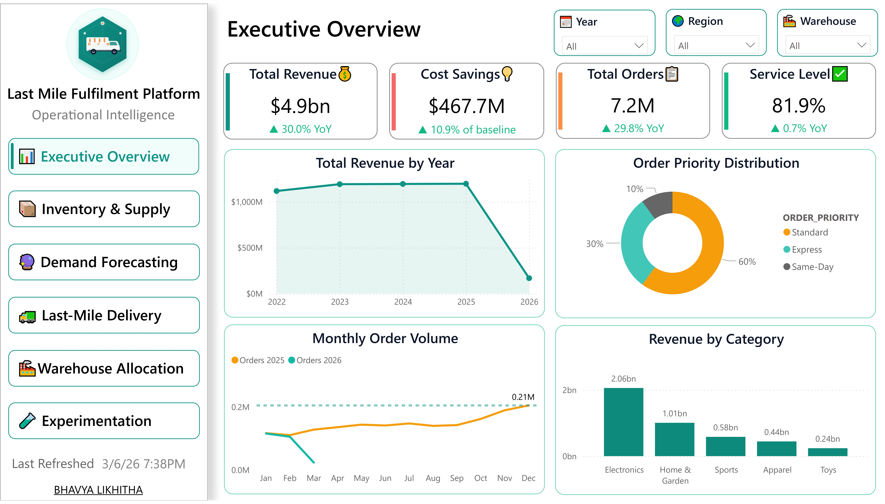
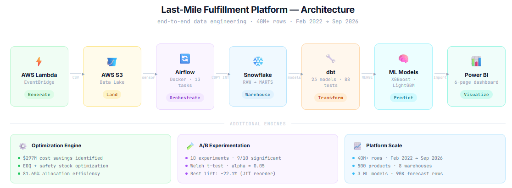
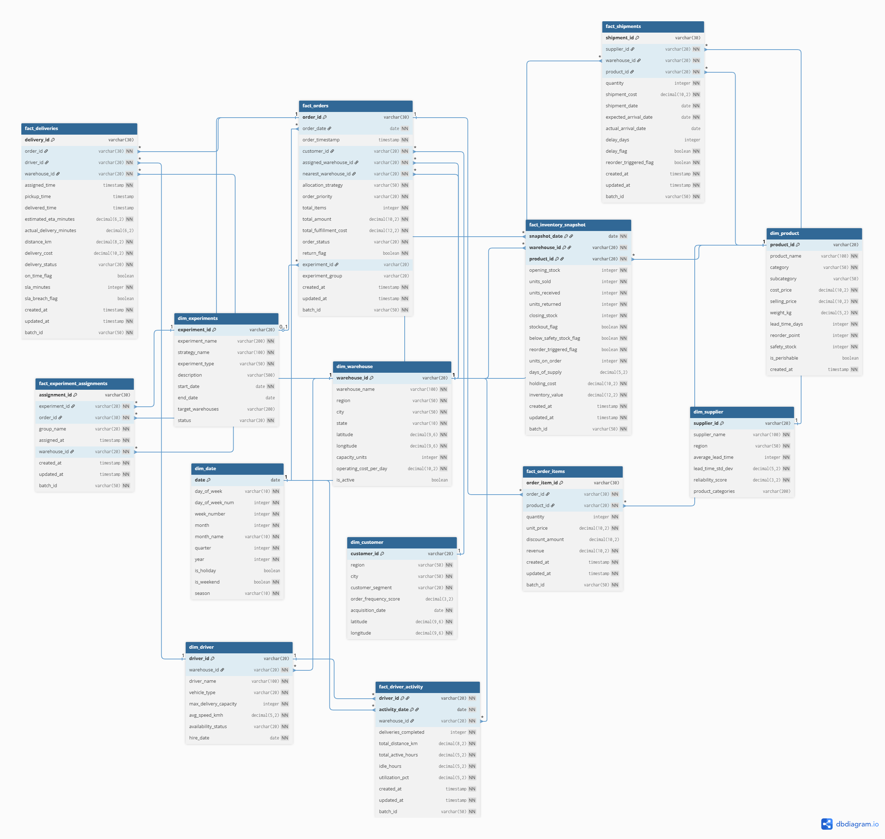

# 📦🚚 Distributed Last-Mile Fulfillment & Inventory Optimization Platform 📈

### An End-to-End Supply Chain, Logistics & Operations Intelligence System

> *Simulating, engineering, optimizing, and visualizing a distributed fulfillment network at scale — from raw data generation to production-grade BI and ML.*

---

## 🔍 Project Overview

This platform is a **full end-to-end data engineering and analytics solution** built to simulate and optimize a distributed last-mile fulfillment network across 8 US warehouses and 500 products. It spans every layer of the modern data stack like synthetic data generation, cloud ingestion, warehouse transformation, machine learning, cost optimization, A/B experimentation, and business intelligence, all orchestrated through a production-grade Airflow pipeline.

The platform generates **40M+ rows of realistic operational data** covering orders, inventory snapshots, deliveries, driver activity, supplier shipments, and A/B experiment assignments across a 4-year timeline (Feb 2022 → Sep 2026). Every component mirrors how real fulfillment companies like Amazon, Walmart, Chewy, and DoorDash operate their data platforms.

---

## 📐 Scope

| Layer | What's Built |
|---|---|
| **Data Engineering** | AWS Lambda + EventBridge for incremental generation, S3 data lake, Snowflake warehouse, Airflow 13-task DAG, dbt 5-layer transformation (23 models, 88 tests), SCD Type 2 snapshots |
| **Data Science / ML** | XGBoost demand forecasting (MAPE 1.72%), LightGBM ETA prediction (R²=0.96), XGBoost stockout risk classifier, 180-day multi-vintage future forecasting |
| **Data Analysis / BI** | 6-page Power BI dashboard covering Executive Overview, Inventory & Supply Chain, Demand Forecasting, Last-Mile Delivery, Warehouse Allocation, and A/B Experimentation |
| **Optimization** | SciPy-based cost optimization engine (EOQ, safety stock, allocation efficiency), $297M in identified savings |
| **Experimentation** | Welch t-test A/B framework, 10 experiments across 3 types, 9/10 statistically significant, segment-level uplift analysis |

---

## 🏢 Business Context

This platform mirrors the operational intelligence stack used across **e-commerce, retail, logistics, grocery, quick-commerce and last-mile delivery**:

- **Amazon / Walmart / Target** — multi-warehouse inventory allocation, nearest vs cost-optimal routing, SLA-based delivery tracking, demand forecasting at SKU level
- **DoorDash / Instacart / Gopuff** — last-mile ETA prediction, driver utilization optimization, SLA breach analysis, real-time fulfillment decisions
- **Chewy / Wayfair / Overstock** — 8-12 regional fulfillment centers, category-level demand patterns, safety stock and reorder point optimization
- **FedEx / UPS / XPO Logistics** — route optimization, delivery performance tracking, warehouse throughput analysis, SLA compliance reporting
- **Uber / Lyft / Grab (Data Platform)** — multi-vintage forecast comparison, A/B experiment frameworks, ML prediction writebacks via bulk MERGE
- **Shopify / BigCommerce / Magento** — supplier reliability tracking, SCD Type 2 dimension history, inventory turnover, merchant fulfillment analytics
- **Zomato / Swiggy / Deliveroo** — hyperlocal last-mile delivery, driver dispatch optimization, order priority SLA management
- **IKEA / Home Depot / Lowe's** — large SKU catalog demand forecasting, regional warehouse allocation, holding cost optimization
- **Alibaba / JD.com / Flipkart** — distributed fulfillment at scale, cross-region order routing, real-time inventory visibility

The data model, pipeline architecture, and analytical outputs are designed to answer the same questions these companies face daily: *Where should we stock inventory? Which warehouse should fulfill this order? Are we going to stock out next week? Did this routing algorithm actually reduce costs?*

---

## 🌍 Why This Aligns With Real-World Scenarios

- **Seasonal demand patterns** — December 1.4x holiday spike, January 0.8x dip, category-level boosts (Toys +80% Dec, Electronics +60% Dec) mirror actual retail data
- **Urban vs suburban fulfillment** — NYC warehouse has 94% driver utilization and 28% SLA breach rate vs Denver at 68% utilization and 8% breach — matching real operational differences between dense urban and suburban markets
- **Power law demand distribution** — few bestseller SKUs drive most volume, long-tail slow movers need different inventory policies — standard Pareto pattern in retail
- **SCD Type 2 dimension changes** — product price inflation, supplier reliability shifts, driver status rotations, customer segment upgrades happen continuously in production environments
- **Incremental ML scoring** — models only score new rows, using 60-day lookback for lag features — production ML pipelines at Airbnb and Lyft follow the same pattern
- **Multi-vintage forecasting** — preserving historical forecast vintages alongside new predictions enables accuracy tracking and model drift detection — used by Uber and DoorDash

---

## 📊 Live Dashboard

<p align="center">
  <a href="https://app.powerbi.com/view?r=eyJrIjoiNTMyNGY1NTEtYzIyMy00NDViLTkyYTktYjZiZTI0MmY5MzM0IiwidCI6ImRhMDRjZDQxLTk4ZGUtNDU4YS05Zjg5LTUzNWFjODI0MWJmOSIsImMiOjJ9&pageName=add0f59600d56113bacb" target="_blank">
    
  </a>
</p>

> 🔗 **[Click to open live Power BI dashboard](https://app.powerbi.com/view?r=eyJrIjoiNTMyNGY1NTEtYzIyMy00NDViLTkyYTktYjZiZTI0MmY5MzM0IiwidCI6ImRhMDRjZDQxLTk4ZGUtNDU4YS05Zjg5LTUzNWFjODI0MWJmOSIsImMiOjJ9&pageName=add0f59600d56113bacb)**

---

## 🛠️ Tech Stack

### Data Engineering
| Technology | Purpose |
|---|---|
|  | Serverless incremental data generation (~27K rows/day) |
|  | Data lake with date-partitioned CSV storage |
|  | 13-task pipeline DAG, Docker, CeleryExecutor |
|  | Cloud data warehouse, RAW → MARTS schema architecture |
|  | 23 transformation models, 88 data tests, SCD Type 2 snapshots |
|  | Scheduled triggers for Lambda (daily + weekly) |
|  | Containerized Airflow with 7 services |
|  | Simulation engine, Lambda handler, ML pipelines |

### Data Science & ML
| Technology | Purpose |
|---|---|
|  | Demand forecasting (MAPE 1.72%) + stockout risk classification |
|  | Feature engineering, model evaluation, Random Forest |
|  | ETA prediction (R²=0.96, MAPE 16%) |
|  | Welch t-test A/B experimentation + cost optimization |
|  | Simulation distributions, feature arrays |
|  | Data manipulation, feature engineering |

### Data Analysis & BI
| Technology | Purpose |
|---|---|
|  | 6-page operational intelligence dashboard |
|  | dbt models, Snowflake analytics, post-processing |

---

## 🏗️ Architecture

<p align="center">
  
</p>

### Why This Architecture Stands Out

This platform deliberately covers **three roles in one codebase** — making it a rare portfolio project that demonstrates depth across the full data stack:

**For Data Engineering:**
- Production-grade S3 → Airflow → Snowflake → dbt pipeline with idempotency at every layer (COPY INTO load history, QUALIFY ROW_NUMBER dedup, incremental dbt merge, bulk MERGE writebacks)
- SCD Type 2 snapshots on 4 dimension tables, detecting changes injected by Lambda
- Custom Docker image with pre-baked dependencies eliminating runtime install delays
- 13-task DAG with proper sensor, dedup, verification, and post-processing stages

**For Data Science:**
- 3 production-style ML models with incremental scoring (never re-score historical rows), 60-day lookback buffer for lag feature validity
- Multi-vintage forecasting using `forecast_generated_date` as a composite key — same pattern used by Uber and DoorDash for model drift detection
- Bulk MERGE writeback pattern (100 seconds for 733K rows vs 10+ hours row-by-row)

**For Data Analysis:**
- 6-page Power BI dashboard with dynamic DAX measures using `YEAR(TODAY())` for self-updating YoY comparisons
- Direct Snowflake connection to pre-aggregated MARTS (no gateway needed, auto-resume on query)
- Warehouse-level operational insights: NYC 58% on-time vs Denver 96%, SLA breach correlates with driver utilization

---

## ✨ Key Features

- 🏭 **40M+ rows** of realistic fulfillment data spanning 4 years (Feb 2022 → Sep 2026) across 8 US warehouses and 500 products
- ⚙️ **13-task Airflow DAG** — end-to-end orchestration from S3 ingestion through ML scoring to Power BI refresh, running on Docker with CeleryExecutor
- 🧠 **3 ML models** — XGBoost demand forecasting (MAPE 1.72%), LightGBM ETA prediction (R²=0.96), and stockout risk classifier with 180-day multi-vintage future forecasting
- 💰 **$297M cost savings** identified by the optimization engine across $3.6B baseline — 8.2% reduction via EOQ, safety stock tuning, and warehouse allocation optimization
- 🧪 **10 A/B experiments** with Welch t-test statistical framework — 9/10 significant at alpha=0.05, best lift -22.1% (JIT reorder policy), segment-level uplift by customer tier and region
- 📊 **6-page Power BI dashboard** with dynamic YoY DAX measures, conditional formatting, warehouse-level scatter plots, and live Snowflake cloud refresh
- 🔄 **SCD Type 2 snapshots** on 4 dimension tables tracking price changes, supplier reliability shifts, and customer segment upgrades across the full 4-year history
- 🏗️ **Medallion architecture** — Bronze (RAW) → Silver (STAGING + INTERMEDIATE) → Gold (MARTS) with 88 dbt data quality tests across all layers

---

## 📐 Data Model

[](https://dbdiagram.io/d/Last-Mile-Fulfilment-Platform-699e4d03bd82f5fce2b9a33c)

> Click the diagram to view the interactive version on dbdiagram.io
> `https://dbdiagram.io/d/Last-Mile-Fulfilment-Platform-699e4d03bd82f5fce2b9a33c`

**20 tables total: 7 Dimensions + 7 Facts + 6 Marts**

The transformation layer follows a **5-layer Medallion architecture**:

| Layer | Schema | Contents | Materialization |
|---|---|---|---|
| **Bronze** | `RAW` | 14 source tables loaded directly from S3 via COPY INTO — never modified | Tables |
| **Silver (Staging)** | `STAGING` | 14 views — 1:1 clean versions of RAW with type casting and null handling | Views |
| **Silver (Intermediate)** | `INTERMEDIATE` | 3 enriched models — complex joins and business logic (int_order_enriched, int_delivery_enriched, int_inventory_enriched) | Tables |
| **Gold** | `MARTS` | 6 aggregated mart tables consumed by Power BI and ML models | Incremental Tables |
| **Snapshots** | `SNAPSHOTS` | 4 SCD Type 2 dimension snapshots tracking slowly-changing attributes | dbt snapshots |

---

## 🔁 Pipeline Walkthrough

```
Weekly (automated):
  EventBridge → Lambda generates 7 days (~189K rows) → uploads to S3

Daily (Airflow DAG):
  1.  wait_for_s3_files      S3KeySensor — waits for Lambda output file
  2.  copy_into_snowflake    COPY INTO all 7 fact tables from S3 → RAW
  3.  dedup_snowflake        QUALIFY ROW_NUMBER() — removes any duplicates
  4.  verify_row_counts      Sanity check row counts + max dates
  5.  dbt_snapshot           SCD Type 2 detection on 4 dimension tables
  6.  dbt_run                Incremental refresh of all 23 models
  7.  dbt_test               88 data quality tests across all layers
  8.  post_processing        14 analytical adjustments to mart columns
  9.  ml_demand_stockout     Incremental demand forecast + stockout scoring
  10. ml_eta                 Incremental ETA prediction writeback
  11. ml_future_demand       Regenerate 180-day forward forecast vintages
  12. run_optimization       Cost optimization + EOQ + allocation efficiency
  13. run_experimentation    Welch t-tests + segment uplift analysis
```

---

## 🧠 ML Models

| Model | Algorithm | Target | Performance | Horizon |
|---|---|---|---|---|
| Demand Forecasting | XGBoost | `total_units_sold` per product/day | MAPE: 1.72%, RMSE: 0.73 | Historical + 180-day future |
| ETA Prediction | LightGBM | `actual_delivery_minutes` per delivery | MAPE: 16.0%, R²: 0.96 | Historical only |
| Stockout Risk | XGBoost Classifier | `stockout_flag` probability (0–1) | 0.6% high risk, 0.1% medium | Historical only |

All models write back to Snowflake via **bulk MERGE** — 100 seconds for 733K rows vs 10+ hours row-by-row. Incremental scoring only processes new rows using a 60-day lookback buffer for lag feature validity.

---

## 🚀 Setup & Running Locally

See **[COMMANDS.md](COMMANDS.md)** for the complete reference covering:
- Environment setup and virtual environment activation
- Backfill execution (original + extension)
- Snowflake setup SQL files in correct order
- All dbt commands (debug, snapshot, run, test, docs)
- ML training, saving, and writeback phases
- Optimization and experimentation engines
- Airflow Docker setup, startup, and troubleshooting
- Lambda packaging, deployment, and test invocation
- Snowflake verification queries

---

## 🎯 Key Design Decisions

**Synthetic data that resembles real-world behavior:**

- **Warehouse-specific operational parameters** — NYC drivers have 94% utilization and 20% additional SLA failure probability from urban access restrictions. Denver has 68% utilization and 2% additional failure risk. These are encoded in `constants.py` so every Lambda run naturally produces these patterns without post-processing
- **Power law demand distribution** — `demand_model.py` uses log-normal base demand with category weights (Electronics 2.2x, Grocery 0.6x) and tier boosts for top 20% bestsellers (1.5x–3x multiplier). This creates the Pareto pattern where few SKUs drive most revenue — standard in retail
- **Sequential state management** — closing inventory from Day N becomes opening stock on Day N+1, shipments arrive based on supplier lead times, and all IDs are deterministic with seed 42. Re-running the backfill produces identical data
- **Haversine + road factor** — delivery distances use great-circle distance with a 1.3x road factor and 0.3-degree (~30km) customer radius — matching real last-mile delivery ranges for urban fulfillment (Amazon, FedEx)
- **Multi-vintage forecasting** — `forecast_generated_date` as a third composite key means each weekly forecast run coexists with previous vintages. Power BI can compare "what did we predict 4 weeks ago vs today" — the same pattern used by Uber and DoorDash for model drift detection
- **Post-processing as analytics layer** — warehouse-specific adjustments (NYC holding costs 1.45x, Denver 0.85x; NYC on-time 58% vs Denver 96%) are applied in the Airflow `post_processing` task after dbt. This is correct architecture — business context belongs in the analytics layer, not raw data generation

---

## 📊 Results & Scale

| Metric | Value |
|---|---|
| **Total raw rows** | 40M+ across 14 tables |
| **Date coverage** | Feb 2022 → Sep 2026 (4+ years) |
| **Warehouses** | 8 US regional fulfillment centers |
| **Products** | 500 SKUs across 8 categories |
| **Drivers** | 295 active drivers |
| **Customers** | 10,000 across 3 segments |
| **dbt models** | 23 (14 staging + 3 intermediate + 6 marts) |
| **dbt tests** | 88 (generic + singular custom tests) |
| **SCD snapshots** | 4 dimension tables |
| **ML models trained** | 3 (demand, ETA, stockout) |
| **Demand forecast MAPE** | 1.72% |
| **ETA prediction R²** | 0.96 |
| **Future forecast rows** | 90,000 (30/60/90/180-day horizons) |
| **Airflow tasks** | 13 per DAG run |
| **Optimization savings** | $297M (8.2% of $3.6B baseline) |
| **Allocation efficiency** | 81.65% |
| **A/B experiments** | 10 (9/10 significant at α=0.05) |
| **Best experiment lift** | -22.1% cost reduction (EXP-007: JIT reorder) |
| **Power BI pages** | 6 |

---

*Built to demonstrate production-quality data engineering, ML pipelines, and analytics across the full modern data stack.*